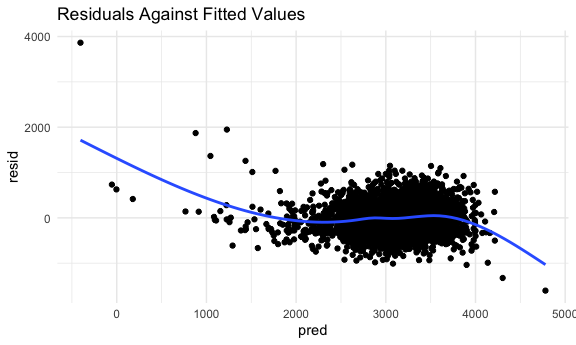
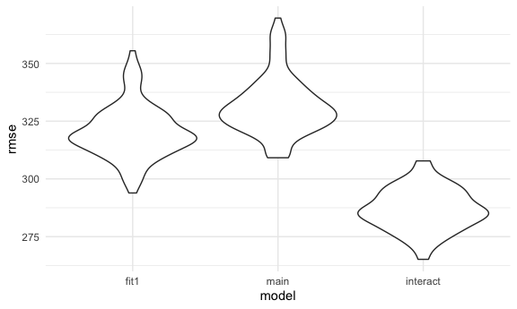
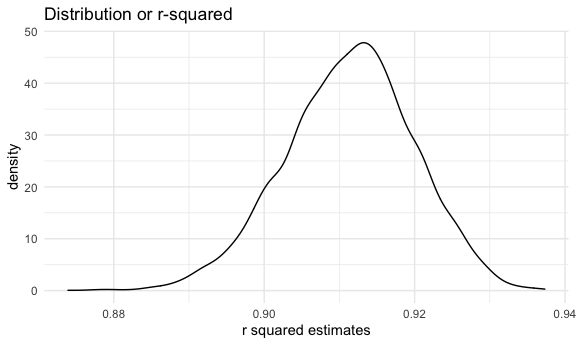
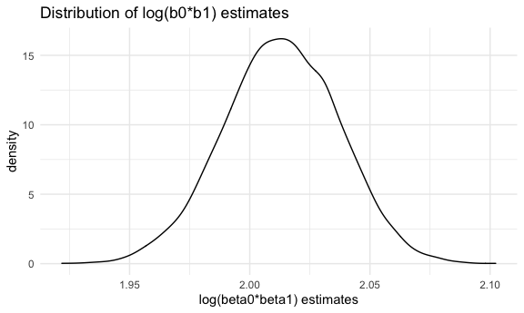

p8105\_hw6\_km3529
================
Karina Myers
12/5/2020

## Problem 1

Create a city\_state variable (e.g. “Baltimore, MD”), and a binary
variable indicating whether the homicide is solved. Omit cities Dallas,
TX; Phoenix, AZ; and Kansas City, MO – these don’t report victim race.
Also omit Tulsa, AL – this is a data entry mistake. For this problem,
limit your analysis those for whom victim\_race is white or black. Be
sure that victim\_age is numeric.

``` r
homicide_df = 
  read_csv("data/homicide-data.csv", na = c("", "NA", "Unknown")) %>% 
  mutate(
    city_state = str_c(city, state, sep = ", "),
    victim_age = as.numeric(victim_age),
    resolution = case_when(
      disposition == "Closed without arrest" ~ 0,
      disposition == "Open/No arrest"        ~ 0,
      disposition == "Closed by arrest"      ~ 1)
  ) %>% 
  filter(
    victim_race %in% c("White", "Black"),
    city_state != "Tulsa, AL") %>% 
  select(city_state, resolution, victim_age, victim_race, victim_sex)
```

    ## Parsed with column specification:
    ## cols(
    ##   uid = col_character(),
    ##   reported_date = col_double(),
    ##   victim_last = col_character(),
    ##   victim_first = col_character(),
    ##   victim_race = col_character(),
    ##   victim_age = col_double(),
    ##   victim_sex = col_character(),
    ##   city = col_character(),
    ##   state = col_character(),
    ##   lat = col_double(),
    ##   lon = col_double(),
    ##   disposition = col_character()
    ## )

For the city of Baltimore, MD, use the glm function to fit a logistic
regression with resolved vs unresolved as the outcome and victim age,
sex and race as predictors. Save the output of glm as an R object; apply
the broom::tidy to this object; and obtain the estimate and confidence
interval of the adjusted odds ratio for solving homicides comparing
non-white victims to white victims keeping all other variables fixed.

``` r
baltimore_df =
  homicide_df %>% 
  filter(city_state == "Baltimore, MD")

glm(resolution ~ victim_age + victim_race + victim_sex, 
    data = baltimore_df,
    family = binomial()) %>% 
  broom::tidy() %>% 
  mutate(
    OR = exp(estimate),
    CI_lower = exp(estimate - 1.96 * std.error),
    CI_upper = exp(estimate + 1.96 * std.error)
  ) %>% 
  select(term, OR, starts_with("CI")) %>% 
  knitr::kable(digits = 3)
```

| term              |    OR | CI\_lower | CI\_upper |
| :---------------- | ----: | --------: | --------: |
| (Intercept)       | 1.363 |     0.975 |     1.907 |
| victim\_age       | 0.993 |     0.987 |     1.000 |
| victim\_raceWhite | 2.320 |     1.648 |     3.268 |
| victim\_sexMale   | 0.426 |     0.325 |     0.558 |

Now run glm for each of the cities in your dataset, and extract the
adjusted odds ratio (and CI) for solving homicides comparing Black
victims to white victims. Do this within a “tidy” pipeline, making use
of purrr::map, list columns, and unnest as necessary to create a
dataframe with estimated ORs and CIs for each city.

``` r
models_results_df = 
  homicide_df %>% 
  nest(data = -city_state) %>% 
  mutate(
    models = 
      map(.x = data, ~glm(resolution ~ victim_age + victim_race + victim_sex, data = .x, family = binomial())),
    results = map(models, broom::tidy)
  ) %>% 
  select(city_state, results) %>% 
  unnest(results) %>% 
  mutate(
    OR = exp(estimate),
    CI_lower = exp(estimate - 1.96 * std.error),
    CI_upper = exp(estimate + 1.96 * std.error)
  ) %>% 
  select(city_state, term, OR, starts_with("CI")) 
```

Create a plot that shows the estimated ORs and CIs for each city.
Organize cities according to estimated OR, and comment on the plot.

``` r
models_results_df %>% 
  filter(term == "victim_sexMale") %>% 
  mutate(city_state = fct_reorder(city_state, OR)) %>% 
  ggplot(aes(x = city_state, y = OR)) + 
  geom_point() + 
  geom_errorbar(aes(ymin = CI_lower, ymax = CI_upper)) + 
  theme(axis.text.x = element_text(angle = 90, hjust = 1))
```


This plot shows the odds ratio of resolution of homicide by arrest
comparing male homicide victims to women, controlling for victim age and
race across 47 US cities. The point estimates are almost all less than
one, meaning that female homicide victims are more likely to have the
homicide resolved by arrest. However, given the confidence intervals,
women homicide victims are more likely to have resolved homicides by
arrest compared to men in about half of the cities.

## Problem 2

Load and clean the data for regression analysis (i.e. convert numeric to
factor where appropriate, check for missing data, etc.).

``` r
baby_df = 
  read.csv("data/birthweight.csv") %>% 
  janitor::clean_names() %>% 
  mutate(
   frace = as.factor(frace),
   frace = recode(frace,
    "1" = "White", 
    "2" = "Black", 
    "3" = "Asian", 
    "4" = "Puerto Rican", 
    "8" = "Other", 
    "9" = "Unknown"),
   mrace = as.factor(mrace),
   mrace = recode(mrace, 
    "1" = "White", 
    "2" = "Black", 
    "3" = "Asian", 
    "4" = "Puerto Rican", 
    "8" = "Other"),
   babysex = as.factor(babysex),
   babysex = recode(babysex, 
     "1" = "male", 
    "2" = "female"),
   malform = as.factor(malform),
   malform = recode(malform,
    "0" = "absent", 
    "1" = "present")) 
```

When loading the dataset, I converted `frace`, `mrace`, `babysex`, and
`malform` to factor variables.

Propose a regression model for birthweight. This model may be based on a
hypothesized structure for the factors that underly birthweight, on a
data-driven model-building process, or a combination of the two.
Describe your modeling process.

I hypothesized that `blength`, `gaweeks`, `malform`, `mrace`, `fincome`,
`smoken`, `parity`, and `pnumlbw` would be in the model. I chose
`blength`, `gaweeks`, and `malform` since are both because they are all
related to the development and growth of the baby. I then chose `mrace`
and `fincome` because there are socioeconomic disparities with low
birthweight, especially with race. I chose mother’s race and family
income as a way to capture sociodemographic risk factors for low birth
weight. I also chose `smoken` since smoking status is another risk
factor for low birth weight. Lastly, I choose `parity` and `pnumlbw`
since they relate to the mother’s gestational history which may impact
birth weight.

I started my model building process with running a simple linear
regression of length on birthweight. From there I added the other
developmental variables (`gaweeks` and `malform`) by adding them in one
by one with an ANOVA.

``` r
bwt_df = 
  baby_df %>% 
  mutate(
    mrace = fct_infreq(mrace)) 
```

Baby’s length at birth

``` r
blength_fit = lm(bwt ~ blength, data = bwt_df)

blength_fit %>% 
  broom::tidy() %>% 
  select(term, estimate, p.value) %>% 
  knitr::kable(digits = 3)
```

| term        |   estimate | p.value |
| :---------- | ---------: | ------: |
| (Intercept) | \-3841.267 |       0 |
| blength     |    139.811 |       0 |

Gestational Age in Weeks

``` r
gaweeks_fit = lm(bwt ~ blength + gaweeks, data = bwt_df)

anova(blength_fit, gaweeks_fit) %>% 
  broom::tidy() %>% 
  knitr::kable(digits = 3)
```

| res.df |       rss | df |    sumsq | statistic | p.value |
| -----: | --------: | -: | -------: | --------: | ------: |
|   4340 | 509297466 | NA |       NA |        NA |      NA |
|   4339 | 481775846 |  1 | 27521621 |   247.867 |       0 |

Presence of malformations that count affect weight

``` r
malform_fit = lm(bwt ~ blength + gaweeks + malform, data = bwt_df)

anova(gaweeks_fit, malform_fit) %>% 
  broom::tidy() %>% 
  knitr::kable(digits = 3)
```

| res.df |       rss | df |    sumsq | statistic | p.value |
| -----: | --------: | -: | -------: | --------: | ------: |
|   4339 | 481775846 | NA |       NA |        NA |      NA |
|   4338 | 481696467 |  1 | 79378.47 |     0.715 |   0.398 |

Length and gestational age in weeks were significant, but malform was
not so I did not include that in future models. From here, I repeated
the same process with known risk factors for low birth weight

Mother’s race

``` r
mrace_fit = lm(bwt ~ blength + gaweeks + mrace, data = bwt_df) 

anova(gaweeks_fit, mrace_fit) %>% 
  broom::tidy() %>% 
  knitr::kable(digits = 3)
```

| res.df |       rss | df |    sumsq | statistic | p.value |
| -----: | --------: | -: | -------: | --------: | ------: |
|   4339 | 481775846 | NA |       NA |        NA |      NA |
|   4336 | 459387087 |  3 | 22388759 |     70.44 |       0 |

Family Income

``` r
fincome_fit = lm(bwt ~ blength + gaweeks + mrace + fincome, data = bwt_df) 

anova(mrace_fit, fincome_fit) %>% 
  broom::tidy() %>% 
  knitr::kable(digits = 3) 
```

| res.df |       rss | df |   sumsq | statistic | p.value |
| -----: | --------: | -: | ------: | --------: | ------: |
|   4336 | 459387087 | NA |      NA |        NA |      NA |
|   4335 | 458205939 |  1 | 1181148 |    11.175 |   0.001 |

Average number of cigarettes smoked per day during pregnancy

``` r
smoke_fit = lm(bwt ~ blength + gaweeks + mrace + fincome + smoken, data = bwt_df)

anova(fincome_fit, smoke_fit) %>% 
  broom::tidy() %>% 
  knitr::kable(digits = 3) 
```

| res.df |       rss | df |   sumsq | statistic | p.value |
| -----: | --------: | -: | ------: | --------: | ------: |
|   4335 | 458205939 | NA |      NA |        NA |      NA |
|   4334 | 451591524 |  1 | 6614415 |     63.48 |       0 |

All three of these improved the model. Lastly, I added parity which was
significant. I hypothesized that `pnumlbw` would be significant.
However, upon examining the data, all the values were 0, so I could not
add it to the model.

Parity

``` r
parity_fit = lm(bwt ~ blength + gaweeks + mrace + fincome + smoken + parity, data = bwt_df)

anova(smoke_fit, parity_fit) %>% 
  broom::tidy() %>% 
  knitr::kable(digits = 3) 
```

| res.df |       rss | df |    sumsq | statistic | p.value |
| -----: | --------: | -: | -------: | --------: | ------: |
|   4334 | 451591524 | NA |       NA |        NA |      NA |
|   4333 | 450779751 |  1 | 811773.3 |     7.803 |   0.005 |

I also hypothesized there may be an interaction between length and age
so I created an interaction term. This was significant, so I kept it in
my model.

``` r
fit1 = lm(bwt ~ blength + gaweeks + mrace + fincome + smoken + blength*gaweeks, data = bwt_df) 

fit1 %>% 
  broom::tidy() %>% 
  knitr::kable(digits = 3)
```

| term              |   estimate | std.error | statistic | p.value |
| :---------------- | ---------: | --------: | --------: | ------: |
| (Intercept)       | \-7784.238 |   726.567 |  \-10.714 |   0.000 |
| blength           |    203.434 |    14.973 |    13.587 |   0.000 |
| gaweeks           |    127.733 |    19.131 |     6.677 |   0.000 |
| mraceBlack        |  \-165.324 |    11.641 |  \-14.201 |   0.000 |
| mracePuerto Rican |  \-109.795 |    22.308 |   \-4.922 |   0.000 |
| mraceAsian        |  \-119.992 |    49.748 |   \-2.412 |   0.016 |
| fincome           |      0.624 |     0.205 |     3.041 |   0.002 |
| smoken            |    \-5.635 |     0.688 |   \-8.189 |   0.000 |
| blength:gaweeks   |    \-2.129 |     0.392 |   \-5.435 |   0.000 |

Show a plot of model residuals against fitted values – use
add\_predictions and add\_residuals in making this plot.

``` r
residuals = 
  bwt_df %>% 
  modelr::add_residuals(fit1) %>% 
  modelr::add_predictions(fit1) %>% 
  ggplot(aes(x = pred, y = resid)) +
  geom_point() +
  geom_smooth(se = FALSE) +
  labs(title = "Residuals Against Fitted Values")
residuals
```

    ## `geom_smooth()` using method = 'gam' and formula 'y ~ s(x, bs = "cs")'



There does not appear to be a distinct trend in the plot. There is a
large cluster and a slight downward slope.

Compare your model to two others:

1)  One using length at birth and gestational age as predictors (main
    effects only)

<!-- end list -->

``` r
fit_main = lm(bwt ~ blength + gaweeks, data = bwt_df)

fit_main %>% 
  broom::tidy() %>% 
  select(term, estimate, p.value) %>% 
  knitr::kable(digits = 3)
```

| term        |   estimate | p.value |
| :---------- | ---------: | ------: |
| (Intercept) | \-4347.667 |       0 |
| blength     |    128.556 |       0 |
| gaweeks     |     27.047 |       0 |

2)  One using head circumference, length, sex, and all interactions
    (including the three-way interaction) between these

<!-- end list -->

``` r
fit_int = lm(bwt ~ bhead + blength + babysex + bhead*blength + bhead*babysex + blength*babysex + bhead*blength*babysex, data = bwt_df) 
      

fit_int %>% 
  broom::tidy() %>% 
  select(term, estimate, p.value) %>% 
  knitr::kable(digits = 3)
```

| term                        |   estimate | p.value |
| :-------------------------- | ---------: | ------: |
| (Intercept)                 | \-7176.817 |   0.000 |
| bhead                       |    181.796 |   0.000 |
| blength                     |    102.127 |   0.000 |
| babysexfemale               |   6374.868 |   0.000 |
| bhead:blength               |    \-0.554 |   0.478 |
| bhead:babysexfemale         |  \-198.393 |   0.000 |
| blength:babysexfemale       |  \-123.773 |   0.000 |
| bhead:blength:babysexfemale |      3.878 |   0.000 |

Make this comparison in terms of the cross-validated prediction error;
use crossv\_mc and functions in purrr as appropriate.

``` r
cv_df = crossv_mc(baby_df, 100)
cv_results = cv_df %>% 
  mutate(
    fit1 = map(train, ~lm(bwt ~ blength + gaweeks + mrace + fincome + smoken + blength*gaweeks, data = bwt_df)), 
    fit2 = map(train, ~lm(bwt ~ blength + gaweeks, data = bwt_df)),
    fit3 = map(train, ~lm(bwt ~ bhead + blength + babysex + bhead * blength + bhead * babysex + blength * babysex +  bhead * blength * babysex, data = bwt_df)),
    rmse_fit1 = map2_dbl(fit1, test, ~rmse(model = .x, data = .y)), 
    rmse_main = map2_dbl(fit2, test, ~rmse(model = .x, data = .y)),
    rmse_interact = map2_dbl(fit3, test, ~rmse(model = .x, data = .y))
  )
```

plot

``` r
cv_results %>% 
  select(starts_with("rmse")) %>% 
  pivot_longer(
    everything(),
    names_to = "model", 
    values_to = "rmse",
    names_prefix = "rmse_") %>% 
  mutate(model = fct_inorder(model)) %>% 
  ggplot(aes(x = model, y = rmse)) + geom_violin()
```



## Problem 3

For this problem, we’ll use the 2017 Central Park weather data that
we’ve seen elsewhere. The code chunk below (adapted from the course
website) will download these data.

``` r
weather_df = 
  rnoaa::meteo_pull_monitors(
    c("USW00094728"),
    var = c("PRCP", "TMIN", "TMAX"), 
    date_min = "2017-01-01",
    date_max = "2017-12-31") %>%
  mutate(
    name = recode(id, USW00094728 = "CentralPark_NY"),
    tmin = tmin / 10,
    tmax = tmax / 10) %>%
  select(name, id, everything())
```

    ## Registered S3 method overwritten by 'hoardr':
    ##   method           from
    ##   print.cache_info httr

    ## using cached file: /Users/karinamyers/Library/Caches/R/noaa_ghcnd/USW00094728.dly

    ## date created (size, mb): 2020-10-03 15:36:59 (7.522)

    ## file min/max dates: 1869-01-01 / 2020-10-31

``` r
set.seed(1)
```

The boostrap is helpful when you’d like to perform inference for a
parameter / value / summary that doesn’t have an easy-to-write-down
distribution in the usual repeated sampling framework. We’ll focus on a
simple linear regression with tmax as the response and tmin as the
predictor, and are interested in the distribution of two quantities
estimated from these data: r̂2 log(β̂0∗β̂1)

Use 5000 bootstrap samples and, for each bootstrap sample, produce
estimates of these two quantities.

``` r
weather_bootstrap = 
  weather_df %>% 
  modelr::bootstrap(n = 5000) %>% 
  mutate(
    models = map(strap, ~ lm(tmax ~ tmin, data = .x)),
    results = map(models, broom::tidy),  
    glance = map(models, broom::glance)) %>% 
  unnest(results, glance) %>% 
  select(.id, r.squared, estimate, term)
```

    ## Warning: unnest() has a new interface. See ?unnest for details.
    ## Try `df %>% unnest(c(results, glance))`, with `mutate()` if needed

``` r
weather_bootstrap
```

    ## # A tibble: 10,000 x 4
    ##    .id   r.squared estimate term       
    ##    <chr>     <dbl>    <dbl> <chr>      
    ##  1 0001      0.907    7.45  (Intercept)
    ##  2 0001      0.907    1.03  tmin       
    ##  3 0002      0.896    7.36  (Intercept)
    ##  4 0002      0.896    1.03  tmin       
    ##  5 0003      0.918    7.48  (Intercept)
    ##  6 0003      0.918    1.04  tmin       
    ##  7 0004      0.899    7.91  (Intercept)
    ##  8 0004      0.899    0.998 tmin       
    ##  9 0005      0.913    6.73  (Intercept)
    ## 10 0005      0.913    1.07  tmin       
    ## # … with 9,990 more rows

``` r
weather_2 = 
  weather_bootstrap %>% 
  select(-.id) %>% 
  pivot_wider(
    names_from = term,
    values_from = estimate) %>% 
   rename(
    b0 = `(Intercept)`,
    b1 = tmin) %>% 
  mutate(log_betas = log(b0*b1))
```

Plot the distribution of your estimates, and describe these in words. R
squared estimated

``` r
weather_2 %>% 
  ggplot(aes(x = r.squared)) +
  geom_density() +
  labs(title = "Distribution or r-squared",
       x = "r squared estimates")
```



``` r
weather_2 %>% 
  ggplot(aes(x = log_betas)) +
  geom_density() +
  labs(title = "Distribution of log(b0*b1) estimates",
       x = "log(beta0*beta1) estimates")
```



These plots show the distribution of r squared and the log beta
estimates. The r squared estimates appear to be normally distributed
around 0.91. The log(b0\*b1) also appears sto be normally distributed
around 2.01.

Using the 5000 bootstrap estimates, identify the 2.5% and 97.5%
quantiles to provide a 95% confidence interval for r̂ 2and log(β̂0∗β̂1

``` r
# Quantiles
quantile(weather_2$r.squared, .025) 
```

    ##      2.5% 
    ## 0.8936684

``` r
quantile(weather_2$r.squared, .975) 
```

    ##    97.5% 
    ## 0.927106

``` r
quantile(weather_2$log_betas, .025)
```

    ##     2.5% 
    ## 1.964949

``` r
quantile(weather_2$log_betas, .975)
```

    ##    97.5% 
    ## 2.058887

The 95% CI for r^2 is 0.8936684, 0.927106. The 95% CI for log(b0\*b1)
1.9649487, 2.0588875.
