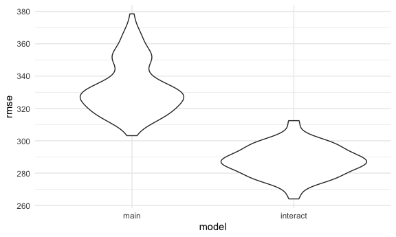

p8105\_hw6\_km3529
================
Karina Myers
12/5/2020

## Problem 1

Create a city\_state variable (e.g. “Baltimore, MD”), and a binary
variable indicating whether the homicide is solved. Omit cities Dallas,
TX; Phoenix, AZ; and Kansas City, MO – these don’t report victim race.
Also omit Tulsa, AL – this is a data entry mistake. For this problem,
limit your analysis those for whom victim\_race is white or black. Be
sure that victim\_age is numeric.

``` r
homicide_df = 
  read_csv("data/homicide-data.csv", na = c("", "NA", "Unknown")) %>% 
  mutate(
    city_state = str_c(city, state, sep = ", "),
    victim_age = as.numeric(victim_age),
    resolution = case_when(
      disposition == "Closed without arrest" ~ 0,
      disposition == "Open/No arrest"        ~ 0,
      disposition == "Closed by arrest"      ~ 1)
  ) %>% 
  filter(
    victim_race %in% c("White", "Black"),
    city_state != "Tulsa, AL") %>% 
  select(city_state, resolution, victim_age, victim_race, victim_sex)
```

    ## Parsed with column specification:
    ## cols(
    ##   uid = col_character(),
    ##   reported_date = col_double(),
    ##   victim_last = col_character(),
    ##   victim_first = col_character(),
    ##   victim_race = col_character(),
    ##   victim_age = col_double(),
    ##   victim_sex = col_character(),
    ##   city = col_character(),
    ##   state = col_character(),
    ##   lat = col_double(),
    ##   lon = col_double(),
    ##   disposition = col_character()
    ## )

For the city of Baltimore, MD, use the glm function to fit a logistic
regression with resolved vs unresolved as the outcome and victim age,
sex and race as predictors. Save the output of glm as an R object; apply
the broom::tidy to this object; and obtain the estimate and confidence
interval of the adjusted odds ratio for solving homicides comparing
non-white victims to white victims keeping all other variables fixed.

``` r
baltimore_df =
  homicide_df %>% 
  filter(city_state == "Baltimore, MD")

glm(resolution ~ victim_age + victim_race + victim_sex, 
    data = baltimore_df,
    family = binomial()) %>% 
  broom::tidy() %>% 
  mutate(
    OR = exp(estimate),
    CI_lower = exp(estimate - 1.96 * std.error),
    CI_upper = exp(estimate + 1.96 * std.error)
  ) %>% 
  select(term, OR, starts_with("CI")) %>% 
  knitr::kable(digits = 3)
```

| term              |    OR | CI\_lower | CI\_upper |
| :---------------- | ----: | --------: | --------: |
| (Intercept)       | 1.363 |     0.975 |     1.907 |
| victim\_age       | 0.993 |     0.987 |     1.000 |
| victim\_raceWhite | 2.320 |     1.648 |     3.268 |
| victim\_sexMale   | 0.426 |     0.325 |     0.558 |

Now run glm for each of the cities in your dataset, and extract the
adjusted odds ratio (and CI) for solving homicides comparing Black
victims to white victims. Do this within a “tidy” pipeline, making use
of purrr::map, list columns, and unnest as necessary to create a
dataframe with estimated ORs and CIs for each city.

``` r
models_results_df = 
  homicide_df %>% 
  nest(data = -city_state) %>% 
  mutate(
    models = 
      map(.x = data, ~glm(resolution ~ victim_age + victim_race + victim_sex, data = .x, family = binomial())),
    results = map(models, broom::tidy)
  ) %>% 
  select(city_state, results) %>% 
  unnest(results) %>% 
  mutate(
    OR = exp(estimate),
    CI_lower = exp(estimate - 1.96 * std.error),
    CI_upper = exp(estimate + 1.96 * std.error)
  ) %>% 
  select(city_state, term, OR, starts_with("CI")) 
```

Create a plot that shows the estimated ORs and CIs for each city.
Organize cities according to estimated OR, and comment on the plot.

``` r
models_results_df %>% 
  filter(term == "victim_sexMale") %>% 
  mutate(city_state = fct_reorder(city_state, OR)) %>% 
  ggplot(aes(x = city_state, y = OR)) + 
  geom_point() + 
  geom_errorbar(aes(ymin = CI_lower, ymax = CI_upper)) + 
  theme(axis.text.x = element_text(angle = 90, hjust = 1))
```


This plot shows the odds ratio of resolution of homicide by arrest
comparing male homicide victims to women, controlling for victim age and
race across 47 US cities. The point estimates are almost all less than
one, meaning that female homicide victims are more likely to have the
homicide resolved by arrest. However, given the confidence intervals,
women homicide victims are more likely to have resolved homicides by
arrest compared to men in about half of the cities.

## Problem 2

Load and clean the data for regression analysis (i.e. convert numeric to
factor where appropriate, check for missing data, etc.).

``` r
baby_df = 
  read.csv("data/birthweight.csv") %>% 
  janitor::clean_names() %>% 
  mutate(
   frace = as.factor(frace),
   frace = recode(frace,
    "1" = "White", 
    "2" = "Black", 
    "3" = "Asian", 
    "4" = "Puerto Rican", 
    "8" = "Other", 
    "9" = "Unknown"),
   mrace = as.factor(mrace),
   mrace = recode(mrace, 
    "1" = "White", 
    "2" = "Black", 
    "3" = "Asian", 
    "4" = "Puerto Rican", 
    "8" = "Other"),
   babysex = as.factor(babysex),
   babysex = recode(babysex, 
     "1" = "male", 
    "2" = "female"),
   malform = as.factor(malform),
   malform = recode(malform,
    "0" = "absent", 
    "1" = "present")) 
```

‘frace’, ‘mrace’, ‘babysex’ and ‘malform’ to factors confirmed no
missing

## Hypothesized model

Propose a regression model for birthweight. This model may be based on a
hypothesized structure for the factors that underly birthweight, on a
data-driven model-building process, or a combination of the two.
Describe your modeling process and show a plot of model residuals
against fitted values – use add\_predictions and add\_residuals in
making this plot.

Compare your model to two others:

1)  One using length at birth and gestational age as predictors (main
    effects only)

<!-- end list -->

``` r
fit1 = lm(bwt ~ blength + gaweeks, data = baby_df)

fit1 %>% 
  broom::tidy() %>% 
  select(term, estimate, p.value) %>% 
  knitr::kable(digits = 3)
```

| term        |   estimate | p.value |
| :---------- | ---------: | ------: |
| (Intercept) | \-4347.667 |       0 |
| blength     |    128.556 |       0 |
| gaweeks     |     27.047 |       0 |

2)  One using head circumference, length, sex, and all interactions
    (including the three-way interaction) between these

<!-- end list -->

``` r
fit2 = lm(bwt ~ bhead + blength + babysex + bhead*blength + bhead*babysex + blength*babysex + bhead*blength*babysex, data = baby_df) 
      

fit2 %>% 
  broom::tidy() %>% 
  select(term, estimate, p.value) %>% 
  knitr::kable(digits = 3)
```

| term                        |   estimate | p.value |
| :-------------------------- | ---------: | ------: |
| (Intercept)                 | \-7176.817 |   0.000 |
| bhead                       |    181.796 |   0.000 |
| blength                     |    102.127 |   0.000 |
| babysexfemale               |   6374.868 |   0.000 |
| bhead:blength               |    \-0.554 |   0.478 |
| bhead:babysexfemale         |  \-198.393 |   0.000 |
| blength:babysexfemale       |  \-123.773 |   0.000 |
| bhead:blength:babysexfemale |      3.878 |   0.000 |

Cross Validation

``` r
cv_df = crossv_mc(baby_df, 100)
cv_results = cv_df %>% 
  mutate(
    fit1 = map(train, ~lm(bwt ~ blength + gaweeks, data = baby_df)),
    fit2 = map(train, ~lm(bwt ~ bhead + blength + babysex + bhead * blength + bhead * babysex + blength * babysex +  bhead * blength * babysex, data = baby_df)),
    rmse_main = map2_dbl(fit1, test, ~rmse(model = .x, data = .y)),
    rmse_interact = map2_dbl(fit2, test, ~rmse(model = .x, data = .y))
  )
```

plot

``` r
cv_results %>% 
  select(starts_with("rmse")) %>% 
  pivot_longer(
    everything(),
    names_to = "model", 
    values_to = "rmse",
    names_prefix = "rmse_") %>% 
  mutate(model = fct_inorder(model)) %>% 
  ggplot(aes(x = model, y = rmse)) + geom_violin()
```


